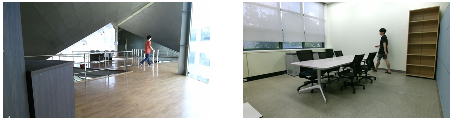

# Automatic-Visual-Surveillance-using-Relation-Network


## Descriptions
This project includes a [Tensorflow](https://www.tensorflow.org/) implementation of **CNN** and **RN**, also, we describe Dataset that used for this project.

### Relation Network
[A Simple Neural Network Module for Relational Reasoning](https://arxiv.org/abs/1706.01427)
### Object Detection
[YOLO9000: Better, Faster, Stronger](https://arxiv.org/abs/1612.08242)

### Dataset
We generate the Dataset for the initial experiment to demonstrate our hypothesis. Our Dataset contain four Class, which are

1) *"Normal"* - Not thing Danger in the CCTV.

<p align="center">
    
</p>

2) *"Danger tool"* - There is danger tool, such as knife or bat in the CCTV. But no one uses it.

<p align="center">
    
</p>

3) *"Potential crime"* - Someone has dangerous tools.

<p align="center">
    
</p>

4) *"Dangerous"* - Someone is doing a danger action using a dangerous tool. For example, wielding a knife or bat.

<p align="center">
    
</p>


## Usage

### Datasets to TF-Record
Before this, Dataset should be changed in h5py format
```bash
$ python TFRecords.py
```

### Train and Eval
```bash
$ python main.py --tpu_use=false --data_dir="Dataset path" --model_dir="path to save model"
```

### Check training status by Tensorboard
```bash
$ tensorboard --logdir="path of model" --host=localhost
```


## Results

### If Object Detection has 100% acc performance.
Our model accuracy & loss


| Approach | Accuracy |
| --- | --- |
| SVM | 31% |
| Decision-Tree | 95% |
| Random Forest | **96%** |
| Gradient Boosting | **96%** |
| MLP | 32% |
| CNN + Object Detection | 32% |
| CNN + Object Detection + RN (OURS) | **96%** |

### If Object Detection has 90% acc performance.
Our model accuracy & loss


| Approach | Accuracy |
| --- | --- |
| SVM | 27% |
| Decision-Tree | 89% |
| Random Forest | 88% |
| Gradient Boosting | 88% |
| MLP | - |
| CNN + Object Detection | - |
| CNN + Object Detection + RN (OURS) | **91%** |

### If Object Detection has 80% acc performance.
Our model accuracy & loss


| Approach | Accuracy |
| --- | --- |
| SVM | 25% |
| Decision-Tree | 81% |
| Random Forest | 80% |
| Gradient Boosting | 80% |
| MLP | - |
| CNN + Object Detection | - |
| CNN + Object Detection + RN (OURS) | **90%** |

### If Object Detection has 70% acc performance.
Our model accuracy & loss


| Approach | Accuracy |
| --- | --- |
| SVM | 23% |
| Decision-Tree | 70% |
| Random Forest | 71% |
| Gradient Boosting | 71% |
| MLP | - |
| CNN + Object Detection | - |
| CNN + Object Detection + RN (OURS) | **88%** |


## Further work
  - [ ] Overfitting Problem.
  - [ ] Integrate the Model, into an End-to-End Model. (Image Processing + Object Detection + Relation Network)
  - [ ] More Dataset, More Situation.
